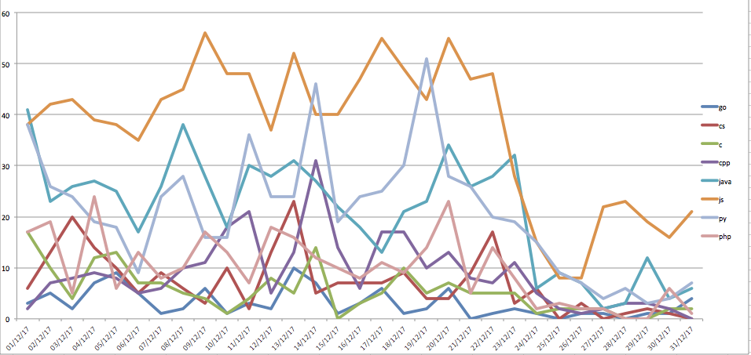
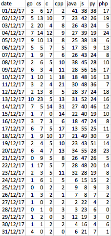

# Github Analysis

## What it does:  

The program searches Github for commits made on a range of dates. It then downloads a random selection of commits and analyses the frequency at which certain file name extensions occur. It produces a CSV file which can be imported into Excel and then turned into a graph showing how certain languages change in popularity over a given date range.   

## How to run:

Open fetchData.py and scroll to the bottom. Change the date ranges for the functions on the last two lines to the desired date range. Run fetchData.py. This may take several hours depending on the date range chosen. Two sets of files will be created in the data folder.

The first set is named according the following pattern: commitSearch{date}-page{page}.json. This contains links to commits made on the given date.

The second set is named according to the pattern: sampleCommits{date}.json. This contains a random selection of commits made on the given date, including lists of files, which were changed in each commit. It is this set of files which is used by the following step.

The final step is to open analyseLanguages.py and change the date range in the final line to match the date range for which you have downloaded the data. Run analyseLanguages.py. As mentioned above, this will produce a CSV file that can be imported into Excel.

Users who wish to change which languages are being analysed can change the includeExtensions list near the top of analyseLanguages.py.     

## Findings:
Due to the time taken to download the data there was only time to download data for December 2017. The results indicate a marked drop off by all languages over the Christmas period. There wasn’t a clear pattern of any particular language changing in popularity relative to others during the Christmas period.

## Conclusions and future development:

The github API returns only a limited number of pages of results. A typical day would see around 700, 000 commits but the search API only returns 34 pages of results with 30 results per page. Therefore, the sample size is quite low. It is possible that with more data we would get a clearer picture from which to draw conclusions.

